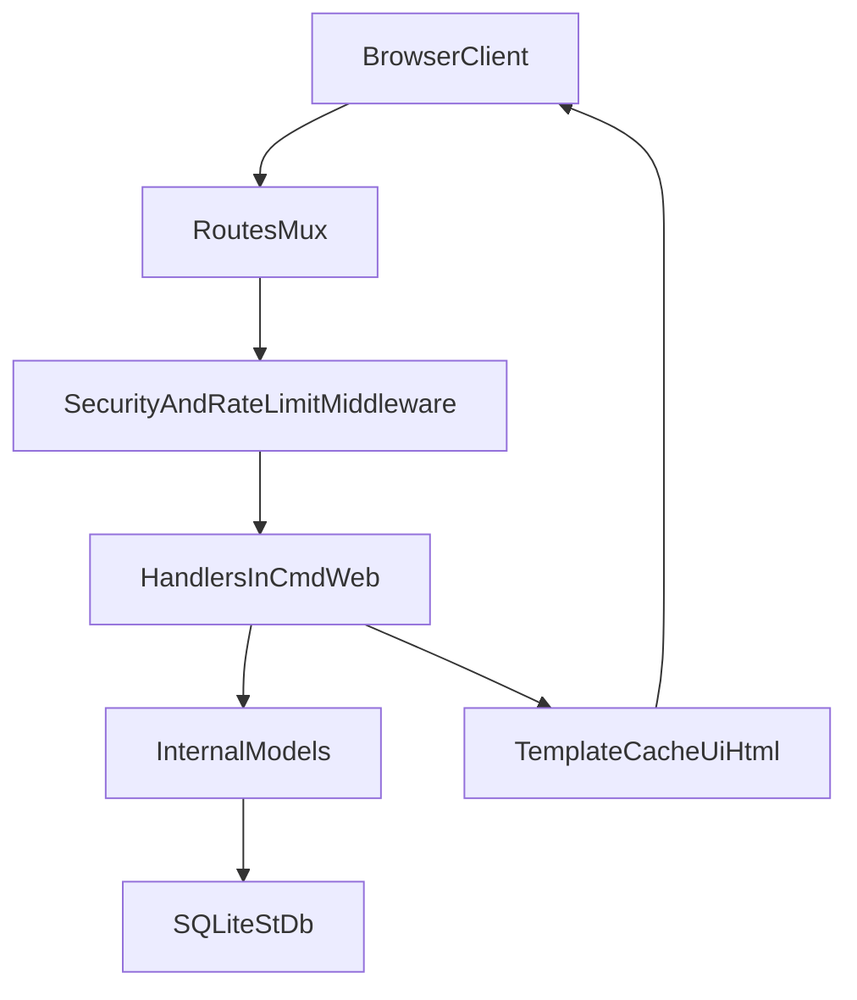

# Architecture and Task Map

This file maps where major behavior lives so important tasks are easier to find and maintain.

## High-Level Structure

- `cmd/web/`: application entrypoint, HTTP routes, handlers, middleware, template rendering
- `internal/models/`: database access and domain logic
- `internal/validator/`: form and field validation helpers
- `ui/html/`: templates (base, partials, pages)
- `ui/static/`: CSS and JS assets
- `init-up.sql`: schema creation
- `Makefile` and `Dockerfile`: local and container workflows

## Runtime Flow

## Important Files by Responsibility

## App startup and server config

- `cmd/web/main.go`
  - loads `.env`
  - validates required env vars
  - opens SQLite DB
  - applies schema from `init-up.sql`
  - starts HTTPS server (`ListenAndServeTLS`)

## Routing and HTTP surface

- `cmd/web/routes.go`
  - route registration for public, authenticated, moderation, admin, and OAuth endpoints

## Request pipeline and guards

- `cmd/web/middleware.go`
  - security headers
  - panic recovery and request logging
  - rate limiter
  - authentication gate (`requireAuthentication`)

## Business logic entry points

- `cmd/web/handlers.go`
  - auth flows (signup/login/logout, OAuth callbacks)
  - forum and comment workflows
  - moderation/reporting flows
  - notification operations

## Data layer

- `internal/models/forum.go`
- `internal/models/forumComments.go`
- `internal/models/forumLikes.go`
- `internal/models/forumNotifications.go`
- `internal/models/users.go`
- `internal/models/sessions.go`
- `internal/models/errors.go`

These files contain SQL operations and domain-state transitions for forum/user/session features.

## Templates and frontend assets

- `cmd/web/template.go` builds template cache from:
  - `ui/html/base.tmpl.html`
  - `ui/html/partials/*.tmpl.html`
  - `ui/html/pages/*.tmpl.html`
- static files served from `ui/static/`

## Important Contributor Tasks

## Add or change an endpoint

1. Register path in `cmd/web/routes.go`.
2. Implement/update handler in `cmd/web/handlers.go`.
3. Add/update model methods in `internal/models/` if DB changes are needed.
4. Update template in `ui/html/pages/` and navigation partials if needed.

## Change data model

1. Update schema in `init-up.sql`.
2. Update related SQL in model files.
3. Verify app startup still succeeds against existing local DB expectations.

## Change authentication/authorization

1. Update session/role logic in `internal/models/sessions.go` and `internal/models/users.go`.
2. Apply route-level protection in `cmd/web/routes.go` via `requireAuthentication`.
3. Update handler-level role checks in `cmd/web/handlers.go`.

## Update setup/runtime workflow

1. Align `Makefile`, `Dockerfile`, and runtime assumptions in `cmd/web/main.go`.
2. Reflect changes in `README.md` and `docs/development.md`.

## Related Docs

- Quickstart: [`../README.md`](../README.md)
- Setup and troubleshooting: [`./development.md`](./development.md)
- Audit and modernization actions: [`./audit-and-refresh.md`](./audit-and-refresh.md)
